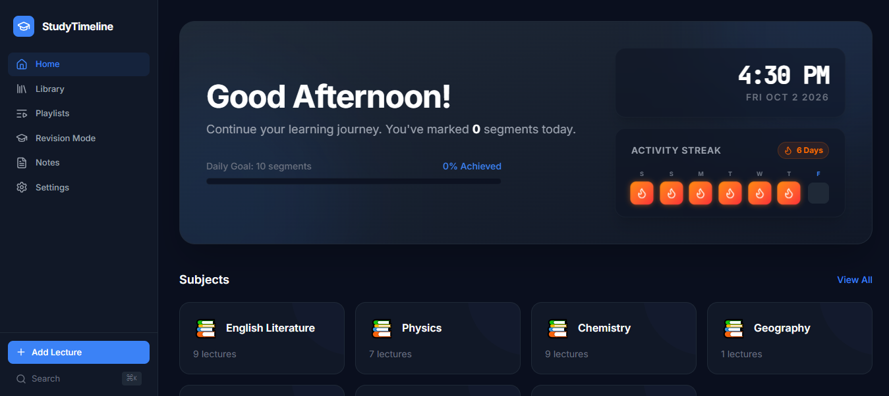
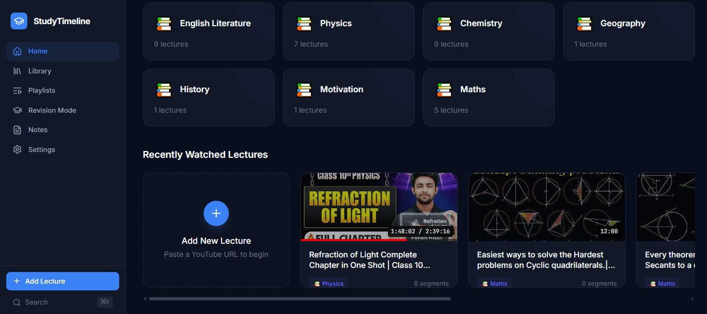
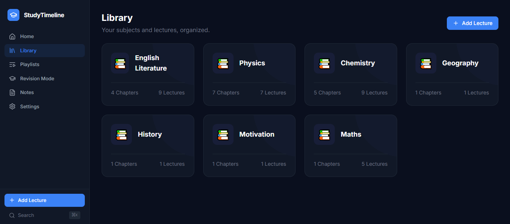
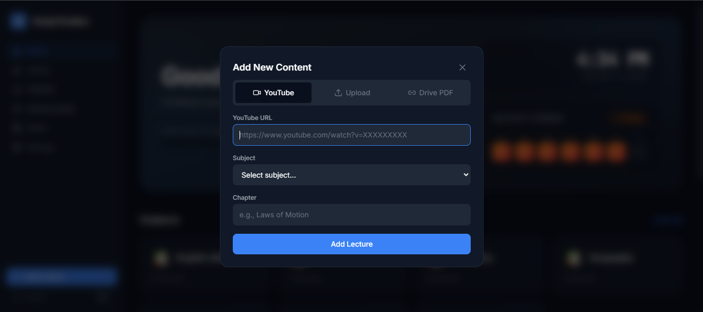
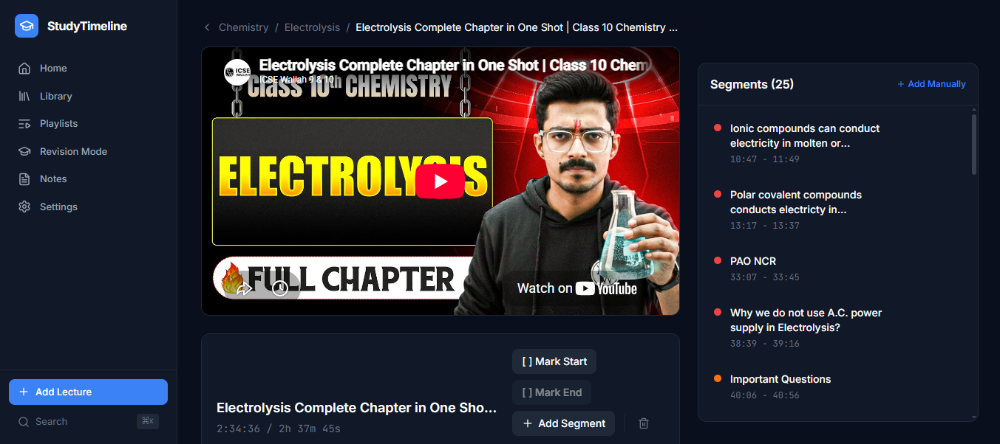
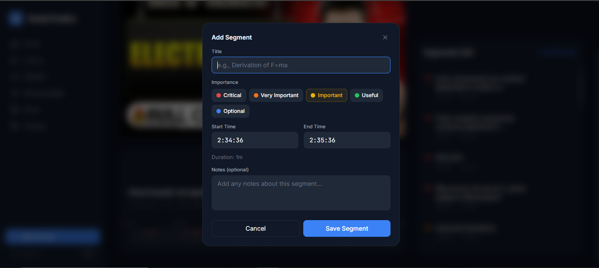
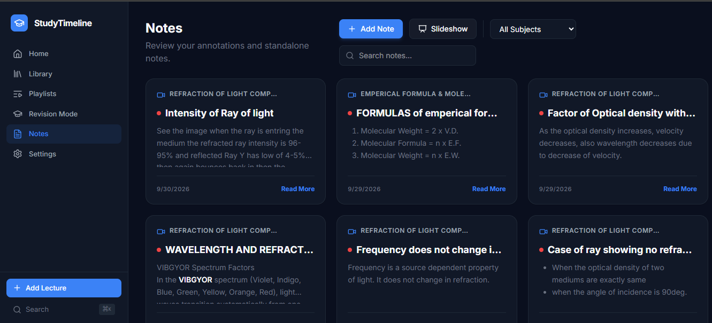
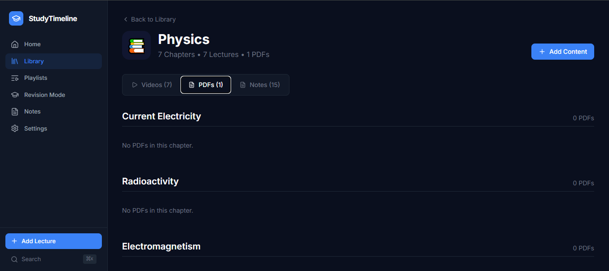
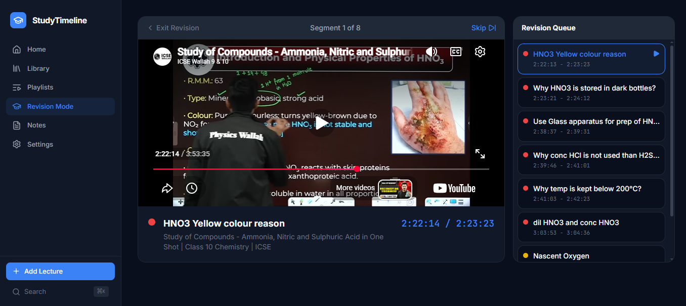

# 🎓 StudyTimeline 
<p align="center">
  
  
  
  
</p>

<div align="
    

  &nbsp;&nbsp;<strong>Live Demo link 👉 <a href="https://study-timeline-eight.vercel.app">study-timeline-eight.vercel.app</a></strong>
</div>

## 🎯 The Pitch: Why I Built This

**The Problem:**
While preparing for exams, I relied heavily on YouTube for educational lectures. However, a major pain point was that these videos are often 2 to 3 hours long. When revising a day before the exam, I didn't have time to re-watch the entire video or scrub through trying to find that *one* crucial 5-minute formula derivation or concept explanation. Jotting down timestamps in a physical notebook was tedious and didn't let me seamlessly jump between important segments.

**The Solution:**
I created **StudyTimeline** to transform passive YouTube watching into an active, organized revision system. It allows me to build a structured library, watch videos without distractions, and most importantly, mark specific start and end times (segments) for important parts of a lecture. When it's time to revise, the app's Revision Engine pieces together these crucial segments into a customized, continuous playlist based on how much time I have.

---

## 📸 App Walkthrough & Features

### 1. Home Dashboard
*Your personalized space to get an overview of your study progress and quick access to recent topics.*

<table>
  <tr>
    <td></td>
    <td></td>
  </tr>
</table>

### 2. Structured Library & Adding Content
*Organize your YouTube lectures into a clean hierarchy. Easily add new lectures by providing the YouTube video link.*

<table>
  <tr>
    <td></td>
    <td></td>
  </tr>
</table>

### 3. Smart Lecture Player & Segment Marking
*Watch YouTube videos directly in the app with a distraction-free player. Use keyboard shortcuts to instantly mark start and end times.*

<table>
  <tr>
    <td></td>
    <td></td>
  </tr>
</table>

### 4. Notes & Annotations
*Attach personal notes, priority levels (e.g., Critical, Important), and reference resources directly to your specific segments.*

<table>
  <tr>
    <td></td>
    <td></td>
  </tr>
</table>

### 5. Revision Engine
*Exam tomorrow? Tell the app you have 30 minutes, select a subject, and it generates a custom, continuous playlist of only your highest-priority segments.*

<table>
  <tr>
    <td></td>
  </tr>
</table>

---

## 🛠️ Technology Stack

- **Frontend Framework:** React 19 + TypeScript
- **Build Tool:** Vite
- **Styling:** Tailwind CSS (v4)
- **Database & Auth:** Firebase Firestore + Firebase Anonymous Authentication
- **Icons:** Lucide React
- **Video API:** Official YouTube IFrame API

---

## 🚀 Getting Started (Local Development)

To run this project locally, follow these steps:

### 1. Clone the repository
```bash
git clone https://github.com/your-username/studytimeline.git
cd studytimeline
```

### 2. Install Dependencies
```bash
npm install
```

### 3. Configure Firebase
1. Create a project in the [Firebase Console](https://console.firebase.google.com/).
2. Enable **Firestore Database** and **Anonymous Authentication**.
3. Apply the security rules found in `firestore.rules`.
4. Copy `.env.example` to `.env` and fill in your Firebase project configuration:
```bash
cp .env.example .env
```

### 4. Start the Development Server
```bash
npm run dev
```
The app will be available at `http://localhost:5173`.

---

## ☁️ Deployment

This project is optimized for deployment on **Netlify**. 
A `netlify.toml` file is included with pre-configured build commands, Single Page Application (SPA) routing redirects, and security headers. 

Simply connect your GitHub repository to Netlify and add your `.env` variables in the Netlify dashboard.

---

## 📜 License

This project is open-source and available under the [MIT License](LICENSE).
